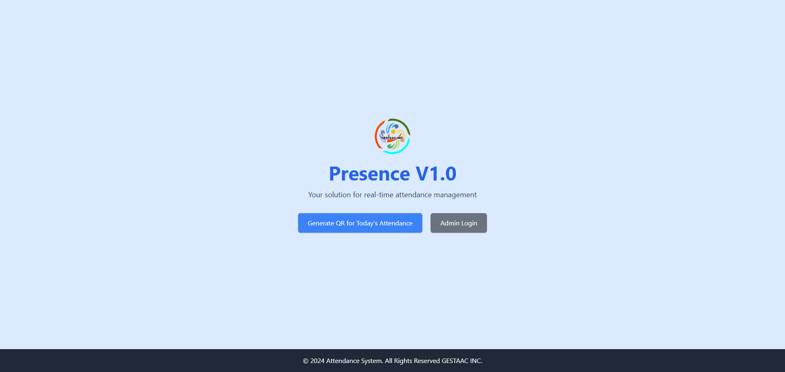
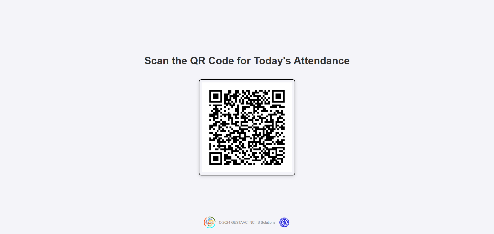
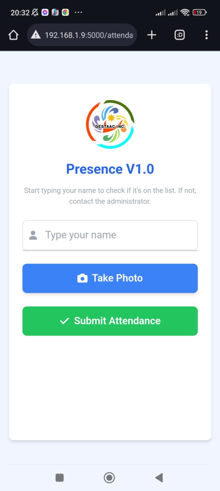
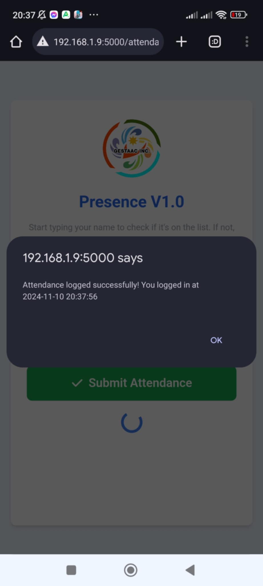
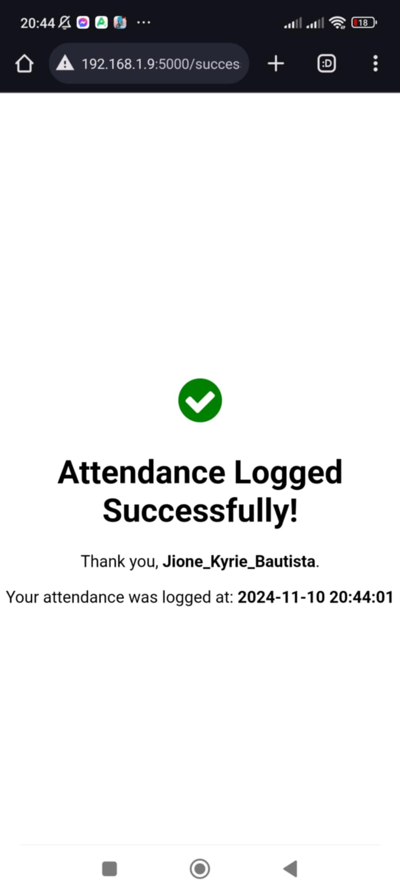
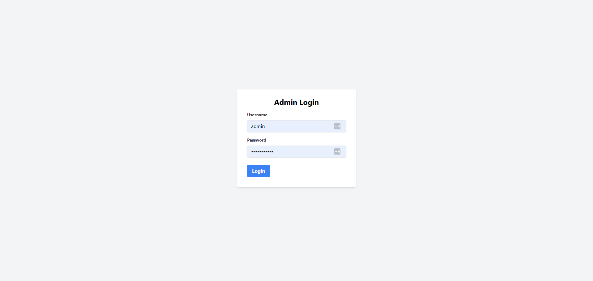
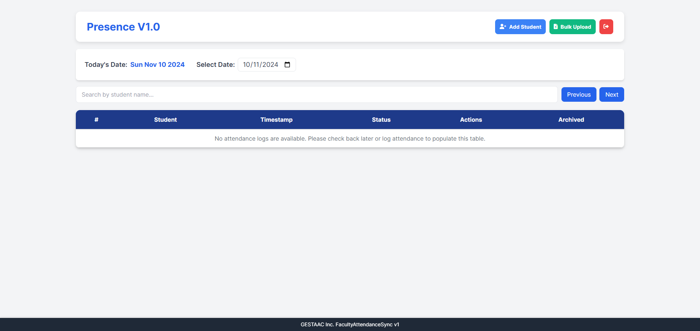
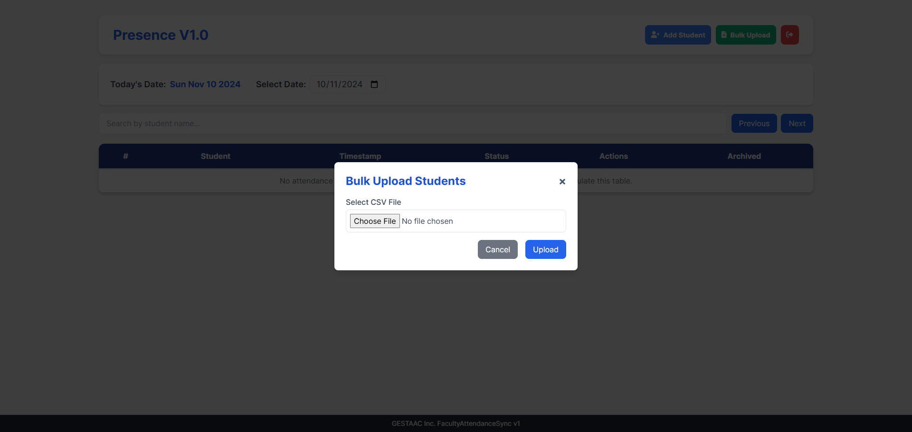
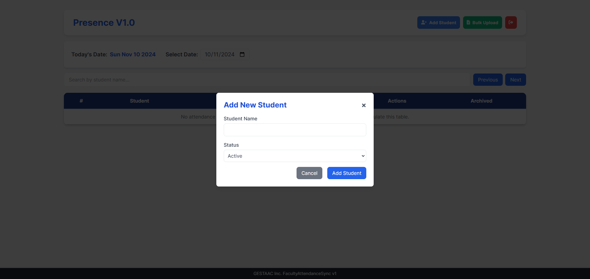
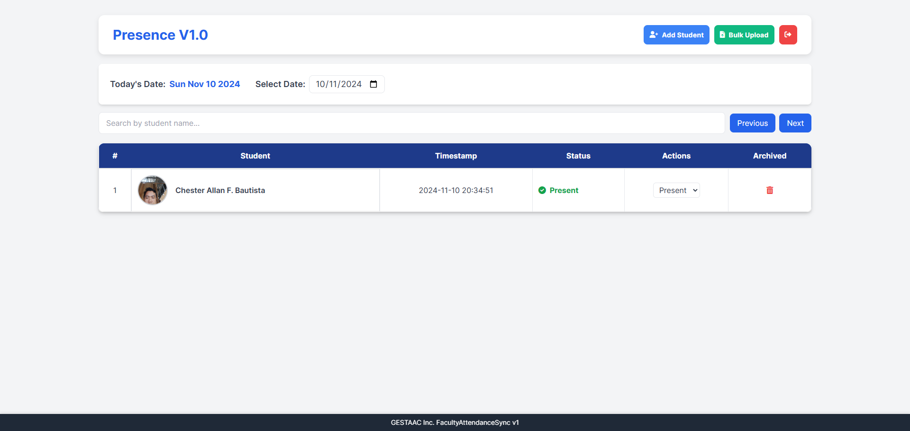

# Presence V1.0

**Presence V1.0** is a LAN-based application designed to streamline student attendance tracking and management. This system allows students to log their attendance seamlessly using QR codes, while administrators can manage and monitor attendance records effectively through an intuitive dashboard. Additionally, it features a speech synthesis system that notifies administrators by announcing the first name of students as they log in.

## Features

### Student Features
- **Log Attendance via QR Code**: Students can scan a QR code to log their attendance instantly.
- **Autocomplete Name Search**: The system provides an autocomplete feature linked to the database to ensure efficient and accurate name selection.
- **Verify Student Existence**: The app verifies if the student exists in the database before logging attendance.
- **Attendance Validation**: Checks if a student has already logged their attendance for the day.
- **Take Student Photos**: Captures a real-time photo of the student for attendance verification.
- **Duplicate Entry Prevention**: Ensures students cannot log their attendance multiple times.

### Administrator Features
- **Bulk Upload of Students**: Administrators can upload a list of students in bulk to populate the database.
- **Add Individual Students**: Add students one at a time with necessary details.
- **Filter Attendance by Date**: View and filter attendance records based on specific dates.
- **Search Students**: Quickly search for students in the attendance list.
- **Override Attendance**: Modify or override a student's attendance status.
- **Archive Students**: Archive students who are no longer active in the system.
- **Speech Synthesis Notifications**: Notifies the administrator by announcing the first name of students who log in, ensuring real-time acknowledgment.

## Screenshots

Below are the screenshots of the app's user interface for both students and administrators. All images are located in the `screens` folder:

### Screenshots for Student Features
1. **Main Page Screen**
   

2. **QR Code Screen**
   

3. **Student Log Screen**
   

4. **Success Login Screen**
   

5. **Success Message Screen**
   

---

### Screenshots for Administrator Features
1. **Admin Login Screen**
   

2. **Main Dashboard Screen**
   

3. **Bulk Upload Students Screen**
   

4. **Add Student Screen**
   

5. **Log Records Screen**
   

---

## Technical Information
- **Platform**: LAN-based application
- **Frontend**: HTML, CSS, and JavaScript
- **Backend**: Flask (Python) for server-side operations
- **Database**: MySQL for student and attendance records
- **Environment**: XAMPP for database and backend management
- **Speech Synthesis**: Uses JavaScript's `speechSynthesis` API for real-time voice notifications.

## Installation and Setup

### Requirements
- Python (3.9 or higher)
- XAMPP (for MySQL)
- Flask and related dependencies

### Steps to Install
1. Clone the repository:
   ```bash
   git clone https://github.com/your-repo-name.git
   ```
2. Navigate to the project folder:
   ```bash
   cd PresenceV1.0
   ```
3. Install required Python packages:
   ```bash
   pip install -r requirements.txt
   ```
4. Start the XAMPP server and set up the database using the provided schema.
5. Run the Flask application:
   ```bash
   python run.py
   ```
6. Access the app in your browser at `http://192.168.1.x:5000`.

---

## Contributions
Feel free to fork the repository and submit pull requests for any enhancements or bug fixes.

## License
This project is licensed under the MIT License.
##All rights Reserved to GESTAAC Inc. Solutions 2024

 

